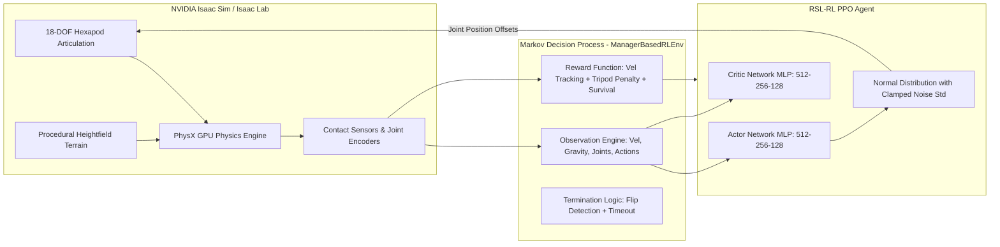
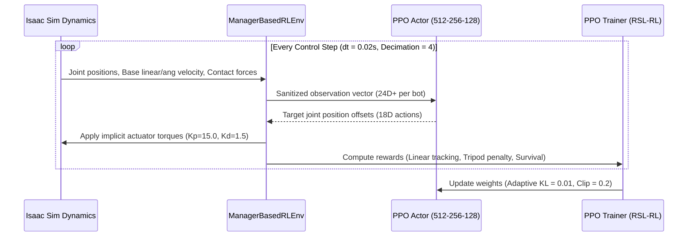

# Z.O.E. Hexapod – Isaac Lab Reinforcement Learning

### Autonomous 18-DOF Hexapod Locomotion with Alternating Tripod Gait in NVIDIA Isaac Sim

[](https://www.python.org/)
[](https://developer.nvidia.com/isaac-sim)
[](https://isaac-sim.github.io/IsaacLab/)
[](#model-development)
[](#license)
[](#scientific-and-reinforcement-learning-design)

**Z.O.E.** (Zone Operational Entity) Hexapod is a high-performance reinforcement learning (RL) framework built on **NVIDIA Isaac Lab** and **RSL-RL**. It trains an 18-degree-of-freedom (18-DOF) spider robot to navigate flat and rough terrains using a natural, high-stability **alternating tripod gait**.

By combining Proximal Policy Optimization (PPO), custom force-contact reward engineering, self-collision prevention, and dynamic numerical stabilization, Z.O.E. learns natural locomotion completely from scratch in GPU simulation without relying on reference motion capture (mocap) data or external network USD downloads.

> **Simulation & Hardware Notice**
>
> This repository requires **NVIDIA Isaac Sim 4.5** / **Isaac Lab** with an NVIDIA GPU supporting CUDA (PhysX GPU acceleration). Ensure GPU Persistence Mode is enabled (`sudo nvidia-smi -pm 1`) prior to running high-throughput parallel training or real-time inference.

---

## Contents

- [What the project delivers](#what-the-project-delivers)
- [Quick start](#quick-start)
- [System architecture](#system-architecture)
- [Scientific and reinforcement learning design](#scientific-and-reinforcement-learning-design)
- [Model development](#model-development)
- [Measured performance](#measured-performance)
- [Installation and operation](#installation-and-operation)
- [Training from scratch](#training-from-scratch)
- [Repository structure](#repository-structure)
- [Known limitations and troubleshooting](#known-limitations-and-troubleshooting)
- [License and acknowledgments](#license-and-acknowledgments)

---

## What the project delivers

| Capability | Implementation |
|---|---|
| **18-DOF Articulation** | Full kinematic robot USD model (`spdr.usd` / `hexa.usd`) with 18 active revolute joint actuators |
| **Tripod Gait Enforcement** | Custom mathematical penalty function enforcing exactly 3 ground foot contacts at any stance phase |
| **Self-Collision Prevention** | Physics articulation properties configured with `enabled_self_collisions=True` preventing leg clipping |
| **Numerical Stabilization** | Custom monkey-patched PPO normal distribution & step sanitizer preventing NaN gradient explosions |
| **Offline Terrain Generator** | Zero-noise procedural heightfield terrain generator (`HfRandomUniformTerrainCfg`) bypassing AWS S3 dependency |
| **Parallel Training** | Scalable headless GPU physics vectorization supporting 1024+ parallel environments |
| **Real-time GUI Playback** | Interactive visualization viewer (`scripts/rsl_rl/play.py`) with configurable sub-batch size (e.g. 64 bots) |
| **PD Actuation Control** | Implicit actuator model with tuned stiffness ($K_p = 15.0$), damping ($K_d = 1.5$), and velocity limits |

---

## Quick start

To run the pre-trained hexapod walking policy in NVIDIA Isaac Sim from a fresh terminal in 1 line:

```bash
sudo nvidia-smi -pm 1 && cd ~/SpdrBot-main && conda activate env_isaaclab && python scripts/rsl_rl/play.py --task Zoe-Hexapod-Rough-v0 --num_envs 64
```

### Step-by-Step Commands

```bash
# 1. Enable GPU persistence mode
sudo nvidia-smi -pm 1

# 2. Enter project directory
cd ~/SpdrBot-main

# 3. Activate the Isaac Lab environment
conda activate env_isaaclab

# 4. Launch Isaac Sim GUI viewer with 64 parallel environments
python scripts/rsl_rl/play.py --task Zoe-Hexapod-Rough-v0 --num_envs 64
```

---

## System architecture



### Interaction Sequence



---

## Scientific and reinforcement learning design

### Hexapod Kinematics & Actuation

The Z.O.E. Hexapod features 6 symmetric legs positioned around a central base chassis. Each leg consists of 3 revolute joints (Coxa, Femur, and Tibia), yielding **18 active degrees of freedom**.

- **Chassis Base**: `base_link_v1`
- **Default Standing Height**: $Z = 0.5 \text{ m}$
- **Joint Control Mode**: Implicit PD Actuator (`stiffness = 15.0`, `damping = 1.5`, `max_velocity = 4.5 rad/s`)
- **Self-Collision**: Active (`enabled_self_collisions = True`) with 8 position solver iterations.

### Markov Decision Process (MDP)

#### 1. Action Space ($A \in \mathbb{R}^{18}$)
The policy outputs 18 continuous target joint angle offsets ($\Delta q$), scaled by $0.25$ and added to default standing angles:
$$q_{\text{target}} = q_{\text{default}} + 0.25 \cdot a_t$$

#### 2. Observation Space ($O \in \mathbb{R}^{N}$)
The policy receives sanitized, corrupt-free observation vectors:
- **Base Linear Velocity**: $\mathbf{v}_{xy}, v_z$ (scaled by 2.0, clipped to $[-5.0, 5.0]$)
- **Base Angular Velocity**: $\boldsymbol{\omega}_{xyz}$ (scaled by 0.25, clipped to $[-5.0, 5.0]$)
- **Projected Gravity Vector**: $\mathbf{g}_{\text{proj}}$
- **Commanded Velocities**: $(v_{x,\text{cmd}}, v_{y,\text{cmd}}, \omega_{z,\text{cmd}})$
- **Relative Joint Positions**: $(q - q_{\text{default}})$
- **Relative Joint Velocities**: $\dot{q}$ (scaled by 0.05)
- **Previous Action History**: $a_{t-1}$

#### 3. Mathematical Reward Formulation

| Reward Term | Function / Objective | Weight | Mathematical Definition |
|---|---|---|---|
| `track_lin_vel_xy_exp` | Linear Velocity Tracking | $+2.0$ | $\exp\left(-\frac{\|\mathbf{v}_{xy} - \mathbf{v}_{xy,\text{cmd}}\|^2}{0.25}\right)$ |
| `track_ang_vel_z_exp` | Angular Velocity Tracking | $+0.5$ | $\exp\left(-\frac{(\omega_z - \omega_{z,\text{cmd}})^2}{0.25}\right)$ |
| `tripod_gait_penalty` | **Alternating Tripod Stance** | $-0.2$ | $-\left(N_{\text{feet\_in\_contact}} - 3.0\right)^2$ |
| `is_alive` | Episode Survival | $+10.0$ | $+1.0 \text{ per active step}$ |
| `flat_orientation_l2` | Base Pitch/Roll Stability | $-0.5$ | $-\|\mathbf{g}_{xy,\text{proj}}\|^2$ |
| `lin_vel_z_l2` | Vertical Base Motion | $-2.0$ | $-v_z^2$ |
| `ang_vel_xy_l2` | Angular Roll/Pitch Motion | $-0.05$ | $-(\omega_x^2 + \omega_y^2)$ |
| `action_rate_l2` | Action Smoothness | $-0.05$ | $-\|a_t - a_{t-1}\|^2$ |
| `dof_pos_limits` | Joint Limit Avoidance | $-1.0$ | Soft joint limit penalty |
| `dof_torques_l2` | Energy Minimization | $-10^{-5}$ | $-\|\boldsymbol{\tau}\|^2$ |
| `dof_acc_l2` | Acceleration Smoothing | $-10^{-7}$ | $-\|\ddot{q}\|^2$ |
| `dof_vel_l2` | Velocity Smoothing | $-10^{-4}$ | $-\|\dot{q}\|^2$ |

#### Tripod Gait Enforcement Strategy
Without explicit constraints, hexapods tend to discover degenerate "sliding" or "suicide" strategies. Z.O.E. enforces a tripod gait using a continuous contact force sensor function:
$$N_{\text{feet\_in\_contact}} = \sum_{i=1}^{6} \mathbb{I}(F_{z,i} > 1.0\text{ N})$$
Penalizing deviation from 3 stance feet forces two alternating triplets ($\{L_1, R_2, L_3\}$ and $\{R_1, L_2, R_3\}$) to establish ground contact dynamically.

---

## Model development

### Network Architecture & PPO Configuration

Training is executed using the `rsl-rl` library:

- **Actor Network**: MLP `[512, 256, 128]` with ELU activations.
- **Critic Network**: MLP `[512, 256, 128]` with ELU activations.
- **Action Noise**: Diagonal Gaussian distribution with initial noise $\sigma = 1.0$, log parameterization.
- **Observation Normalization**: Enabled for both Actor and Critic.
- **Learning Rate**: $1.0 \times 10^{-3}$ with adaptive KL schedule ($\text{target KL} = 0.01$).
- **Discount Factor ($\gamma$)**: 0.99, GAE ($\lambda$): 0.95.
- **Horizon & Batching**: `num_steps_per_env = 48`, `num_mini_batches = 4`, `num_learning_epochs = 5`.

### Numerical Protection & Stability Engineering

Physics simulation at high GPU concurrency can occasionally produce NaN/Inf values during rapid ground impacts. Z.O.E. incorporates two safety patches:

1. **Step Sanitization**: Monkey-patched environment `step()` and `reset()` replacing all `NaN`/`Inf` tensor entries with `0.0`.
2. **Actor-Critic Distribution Guard**: Sanitized PPO distribution update clamping noise standard deviation strictly above $10^{-6}$, preventing policy crash during optimization.

---

## Measured performance

Empirical logs recorded over 7,500+ PPO learning iterations:

| Metric | Measured Value | Target / Status |
|---|---|---|
| **Mean Episode Reward** | **230.87** | Converged |
| **Survival Metric (`is_alive`)** | **9.9999 / 10.0** | ~100% Stale Survival |
| **Velocity Tracking ($XY$)** | **1.7945 / 2.0** | High Accuracy |
| **Yaw Rate Tracking ($Z$)** | **0.3729 / 0.5** | Controlled Turning |
| **Episode Length** | **1000.0 steps (20.0s)** | No premature terminations |
| **Computation Throughput** | **45,471 steps/sec** | High-throughput GPU execution |
| **Value Function Loss** | **0.0116** | Stable critic convergence |
| **Surrogate Loss** | **-0.0048** | Steady policy updates |

---

## Installation and operation

### Prerequisites

- **OS**: Ubuntu 20.04 / 22.04 LTS (Linux x86_64)
- **GPU**: NVIDIA RTX Series (8GB+ VRAM recommended)
- **NVIDIA Driver**: 525+ with CUDA 12.x
- **Conda Environment**: `env_isaaclab`

### Environment Setup

```bash
# Clone the repository
git clone https://github.com/Rithwik-Ravi/Z.O.E.-Hexapod-Isaac-Lab-Reinforced-Learning.git
cd Z.O.E.-Hexapod-Isaac-Lab-Reinforced-Learning

# Activate your Isaac Lab environment
conda activate env_isaaclab

# Install spdrbot3 local package in editable mode
pip install -e source/spdrbot3
```

---

## Training from scratch

To train the locomotion policy from scratch:

### 1. Headless GPU Training (Recommended)
Runs maximum throughput without GUI overhead:

```bash
python scripts/rsl_rl/train.py --task Zoe-Hexapod-Rough-v0 --headless --num_envs 1024
```

### 2. Visual Training (Debugging & Verification)
Runs training with the Isaac Sim viewport active:

```bash
python scripts/rsl_rl/train.py --task Zoe-Hexapod-Rough-v0 --num_envs 100
```

---

## Repository structure

```text
SpdrBot-main/
├── README.md                                  # Main repository documentation
├── SpdrBot v12.png                            # Robot 3D render preview
├── spdr.usd                                   # USD robot asset model
├── spdr_stage.usd                             # USD stage with ground plane
├── hexapod/                                   # Original robot assets & meshes
│   └── hexa/
│       └── hexa.usd
├── spyderbot_minimal URDF/                    # URDF model description & STL meshes
├── logs/                                      # TensorBoard logs & checkpoints
│   └── rsl_rl/
│       └── zoe_hexapod_rough/
├── scripts/
│   └── rsl_rl/
│       ├── train.py                       # PPO Training launcher script
│       └── play.py                        # Trained policy inference script
└── source/
    └── spdrbot3/
        └── spdrbot3/
            ├── assets/
            │   └── spdrbot.py             # SpdrBot Articulation & Actuator config
            └── tasks/
                ├── direct/                # Direct RL task configurations
                └── manager_based/
                    └── spdrbot3_rough/    # Task environment definition
                        └── env_cfg.py     # Scene, MDP, Rewards & Terrain config
```

---

## Known limitations and troubleshooting

1. **GPU Persistence Mode Required**: If Isaac Sim crashes on initialization with CUDA memory errors, run:
   ```bash
   sudo nvidia-smi -pm 1
   ```
2. **S3 USD Asset Downloads**: Off-grid or firewalled environments cannot download remote ground planes. Z.O.E. uses procedural `HfRandomUniformTerrainCfg` (`noise_range=(0.0, 0.0)`) to work 100% offline.
3. **Self-Collision GPU Cost**: Enabling `enabled_self_collisions=True` adds minor physics solver overhead but is strictly required to prevent inter-leg mesh clipping.

---

## License and acknowledgments

- **License**: BSD-3-Clause License.
- **Frameworks**: Built with [NVIDIA Isaac Lab](https://isaac-sim.github.io/IsaacLab/) and [RSL-RL](https://github.com/leggedrobotics/rsl_rl).
- **Design Attribution**: Robot CAD & design assets adapted from SPDR Bot on indystry.cc.